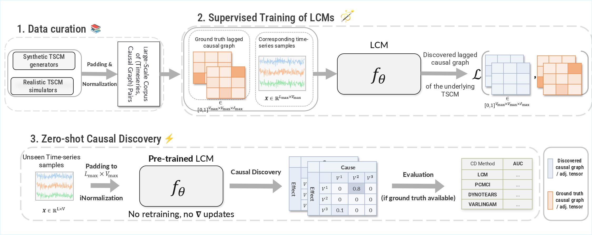
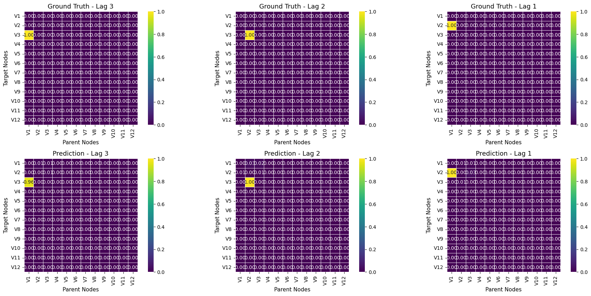

# Large Causal Models for Temporal Causal Discovery

<p align="center">
  <em>Scalable • Robust • Multi-domain • Pre-trained</em>
</p>

<div align="center">

[](https://www.codefactor.io/repository/github/kougioulis/lcm-uoc)


[](https://github.com/kougioulis/large-causal-models/blob/main/LICENSE)
[](https://elocus.lib.uoc.gr/dlib/1/d/9/metadata-dlib-1764761882-792089-25440.tkl)
</div>

Reproducibility experiments of the MSc Thesis *"Large Causal Models for Temporal Causal Discovery"* at the University of Crete (complete LaTeX source of the thesis text is available at: https://github.com/kougioulis/thesis).

---



---

<div align="center">

| Classical Paradigm                       | Large Causal Models              |
| -----------------------------------------| -------------------------------- |
| One model per dataset                    | One model, many datasets         |
| No pretraining                           | Massive multi-domain pretraining |
| Brittle to domain shift                  | Robust & transferable            |
| Slow inference for larger inputs         | Fast inference                   |

</div>

---

## Abstract

Causal discovery for both cross-sectional and temporal data has traditionally followed a dataset-specific paradigm, where a new model is fitted for each individual dataset. Such an approach underutilizes the potential of multi-dataset and large-scale pretraining, especially given recent advances in foundation models. The concept of Large Causal Models (LCMs) envisions a class of pre-trained neural architectures specifically designed for temporal causal discovery. Existing approaches remain largely proofs of concept, typically constrained to small input sizes (e.g., five variables), with performance degrading rapidly to random guessing as the number of variables or model parameters increases. Moreover, current methods rely heavily on synthetic data, generated under arbitrary assumptions, which substantially limits their ability to generalize to realistic or out-of-distribution samples. This work addresses these challenges through novel methods for training on mixtures of synthetic and realistic data collections, enabling both higher input dimensionality and deeper architectures without loss of performance. Extensive experiments demonstrate that LCMs achieve competitive or superior performance compared to classical causal discovery algorithms, while maintaining robustness across diverse domains, especially on non-synthetic data cases. Our findings also highlight promising directions towards integrating interventional samples and domain knowledge, further advancing the development of foundation models for causal discovery.

---

## Contributions

### Large Causal Models
* Introduced **Large Causal Models (LCMs)**; a family of scalable, pre-trained neural architectures for temporal causal discovery, under a supervised paradigm.
* Demonstrated that LCMs achieve **strong zero-shot performance**, **robustness** to domain shift, and remain **competitive or superior** against established causal discovery benchmarks.

### Data Generation

* Developed a **high-fidelity** *synthetic* temporal SCM generation pipeline to support large-scale supervised training of LCMs.
* Developed and utilized [**Temporal Causal-based Simulation (TCS)**](https://github.com/kougioulis/TCS): a generative methodology for creating *simulated* (*realistic*) causal models and corresponding datasets from real multivariate time series samples.
  - **TCS** is used as a **causal model generation mechanism** to augment training of LCMs with realistic (ground truth TSCM, ground truth data) pairs
  - As part of TCS, developed and employed a **causal model selection** (tuning) methodology **(Adversarial Causal Tuning - ACT)** that selects the *optimal causal model* under a *Min-max* scheme on the space of *Classifier 2-sample tests (C2STs)*, treated as discriminators. 
  - ACT functions as an optimal **causal model selection criterion**, **rather than a generative method**, and is therefore a subcomponent of TCS. 
  - Framed **TCS as a principled approach towards causal digital twins**, aiming to generate samples that are statistically indistinguishable from real data while remaining causally interpretable.

### Training at Scale

* Generated *hundreds of thousands* of (data, graph) training pairs, including synthetic and simulated (using TCS).
* Demonstrated that **mixtures** of *synthetic* and *realistic* training data **significantly improve generalization** and zero-shot performance.
* Identified **optimal** synthetic/realistic mixing **ratios**, that align with findings of works on time-series forecasting foundation models.

* Proposed a novel regularizing term to suppress low-support edges and aid model performance.
* Experimentally showed that using observed statistics during training and inference **improves model performance**.

### Comparison with Existing Approaches

* **Benchmarked** against established methods in temporal causal discovery and showcased competitive or superior performance across synthetic, semi-synthetic and realistic datasets
* Demonstrated robustness under domain shift and zero-shot performance.

### Efficiency

* Achieved **significantly faster runtimes** than classical temporal causal discovery methods, thus opening the path to real-time applications.

---

## Setup & Getting Started 

### Conda Environment 🐍

We provide a conda environment for reproducibility purposes only. One can create a virtual conda environment using

- `conda env create -f environment.yaml`
- `conda activate LCM` 

### Using pip

Alternatively, you can just install the dependencies from the `requirements.txt` file using pip, either on your base environment or into an existing conda environment by

- `pip install -r requirements.txt`

---

## Notebooks

`experimental_results.ipynb` contains the experimental results of Section 6.5.

`illustrative_example.ipynb` contains an example of loading a pre-trained LCM, preprocessing a simple synthetic input time-series data and performing causal discovery. It illustrates both the discovered lagged causal graph, as well as the confidence weights of the lagged adjacency tensor and the $AUC$ of the model.

`ablation_experiments.ipynb` contains ablation experiments (Section 6.4.1) and zero-shot experiments on assessing the optimal mixture of realistic and synthetic training data (Section 6.4.2).

| Notebook                     | Description                                | Thesis Section |
| ---------------------------- | ------------------------------------------ | -------------- |
| `experimental_results.ipynb` | Main experimental benchmarks               | §6.5           |
| `illustrative_example.ipynb` | Loading a pretrained LCM & performing CD   | Appendix D     |
| `ablation_experiments.ipynb` | Ablations & optimal training data mixture  | §6.4.1, 6.4.2  |

CSV results used in the thesis are available under `code/data/results/`.

---


## ✨ Pretrained Models

Due to GitHub size limitations, pretrained checkpoints are hosted externally on Google Drive. Provided models handle up to $V_{\max}=12$ variables, maximum lag $\ell_{\max}=3$ and $L=500$ timesteps.

| Model     | Parameters | Link                                                                                              |
| --------- | ---------- | ------------------------------------------------------------------------------------------------- |
| LCM-2.5M (small) | 2.5M       | [Download](https://drive.google.com/file/d/1vjzKMpr7M_feQuFgZGSb5VWRJ_7psV0v/view?usp=sharing)    |
| LCM-9.4M (base) | 9.4M       | [Download](https://drive.google.com/file/d/1UCjLG4Hs6MKSJF_5G3MJmTlhGQVp3qx7/view?usp=drive_link) |
| LCM-12.2M | 12.2M      | [Download](https://drive.google.com/file/d/1bLKASu085xBJ0oqWbhNObcDie94eZFzR/view?usp=sharing)    |
| LCM-24M (large)  | 24M        | [Download](https://drive.google.com/file/d/10gARotO3pK-bYnvpESNBlIV94SqxLxmw/view?usp=drive_link) |

---

## Quick Start

This section shows how to load a pretrained Large Causal Model and perform causal discovery on a small illustrative time-series example. The goal is to demonstrate the minimal workflow. For a more complete notebook, see `illustrative_example.ipynb`.

---

### 1. Load a Pretrained Model

```python
from pathlib import Path
import sys
import torch
sys.path.append("..")  # add project root to PYTHONPATH

from src.modules.lcm_module import LCMModule

model_path = Path("/path/to/pretrained/checkpoints")  # adjust as needed

# Load model
model = LCMModule.load_from_checkpoint(model_path / "LCM_2.5M.ckpt")

device = "cpu"
M = model.model.to(device).eval()
```

---

### 2. Generate Example Data

We now perform causal discovery on a 3-variable time-series generated from the temporal SCM (TSCM):

* $V_1(t) = \epsilon(t)$
* $V_2(t) = 3V_1(t-1) + \epsilon(t)$
* $V_3(t) = V_2(t-2) + 5V_1(t-3) + \epsilon(t)$

where $\epsilon(t)$ is independent Gaussian noise. Thus, the true causal graph corresponds to:

* $V_1 \rightarrow V_2$ (with lag 1)
* $V_1 \rightarrow V_3$ (with lag 3)
* $V_2 \rightarrow V_3$ (with lag 2)

```python
from src.utils.misc_utils import run_illustrative_example

# Model-specific params
MAX_SEQ_LEN = 500
MAX_LAG = 3
MAX_VAR = 12

X_cpd, Y_cpd = run_illustrative_example(n=MAX_SEQ_LEN)
X_cpd = torch.tensor(X_cpd.values, dtype=torch.float32)
```

`run_illustrative_example()` returns (i) a time-series dataset of shape `[T, 3]` (ii) the corresponding binary lagged adjacency tensor for the ground-truth causal graph. Interpretation: `pred[j,i,l] = 1` means variable `i` causes variable `j` at lag `ℓ_max - l`.

---

### 3. Preprocess (Normalize + Pad)

LCMs support up to $V_{\max}=12$ variables, $L_{\max}=500$ timesteps, and causal lags up to $\ell_{\max}=3$. For smaller inputs, we pad in both time and feature dimensions.

```python
# Normalize
X_cpd = (X_cpd - X_cpd.min()) / (X_cpd.max() - X_cpd.min())

# Timesteps padding
if X_cpd.shape[0] < MAX_SEQ_LEN:
    X_cpd = torch.cat([
        X_cpd,
        torch.normal(0, 0.01, (MAX_SEQ_LEN - X_cpd.shape[0], X_cpd.shape[1]))
    ], dim=0)

# Feature + lag padding
VAR_DIF, LAG_DIF = MAX_VAR - X_cpd.shape[1], MAX_LAG - Y_cpd.shape[2]
if VAR_DIF > 0:
    X_cpd = torch.cat([
        X_cpd,
        torch.normal(0, 0.01, (X_cpd.shape[0], VAR_DIF))
    ], dim=1)
    Y_cpd = torch.nn.functional.pad(Y_cpd, (0, 0, 0, VAR_DIF, 0, VAR_DIF), value=0.0)
```

---

### 4. Perform Causal Discovery

```python
from src.utils.utils import lagged_batch_crosscorrelation

with torch.no_grad():
    corr = lagged_batch_crosscorrelation(X_cpd.unsqueeze(0), MAX_LAG)
    pred = torch.sigmoid(M((X_cpd.unsqueeze(0), corr)))
    
    # Remove self-loops for each lag
    for l in range(pred.shape[-1]):
        pred[:, l, l] = 0
```

`pred` is a lagged adjacency tensor where higher values = higher confidence in a directed causal link at a given lag.

---

### 5. Evaluate Causal Discovery Performance

```python
from src.utils.metrics import custom_binary_metrics

print(f"AUC: {custom_binary_metrics(pred, Y_cpd)[0]}")
```

The model succesfully discovers all causal effects, resulting in a perfect AUC score. We can also visualize lag-wise heatmaps against the known ground truth:

```python
plot_adjacency_heatmaps(
    pred_adj=pred.squeeze(0),
    true_adj=Y_cpd,
    absolute_errors=False
)
```




For visualization of the predicted graphs, comparison to ground truth, and additional experiments (ablations, zero-shot transfer, realistic datasets), refer to the accompanying notebook (`illustrative_example.ipynb`).

## Test Sets

We additionally provide the test sets for the experimental evaluations present in the text, available via Google Drive links. The fMRI collections are available in the `data` folder. The synthetic CDML collections is not presented in the main text and can serve as an additional synthetic benchmark.


### Synthetic

- S_Joint (3-5 variables)
  [https://drive.google.com/drive/folders/1RB7umIQH2H3F-kIUWVvVJzJfgv12Sxy8](https://drive.google.com/drive/folders/1RB7umIQH2H3F-kIUWVvVJzJfgv12Sxy8)
- Synth_230K (3-12 variables)
  [https://drive.google.com/drive/folders/1iqwnrMHx8sXWJRd6iysrKg13b-PCwwJs](https://drive.google.com/drive/folders/1iqwnrMHx8sXWJRd6iysrKg13b-PCwwJs)


### Semi-Synthetic (Out-of-distribution - Zero-shot)

- fMRI-5
  [https://github.com/kougioulis/LCM-thesis/tree/main/data/fMRI_5](https://github.com/kougioulis/LCM-thesis/tree/main/data/fMRI_5)
- fMRI
  [https://github.com/kougioulis/LCM-thesis/tree/main/data/fMRI](https://github.com/kougioulis/LCM-thesis/tree/main/data/fMRI)
- Kuramoto-5
  [https://drive.google.com/drive/folders/1Jh9e7o4c60MDkHykX4tJvjwfWZ-khC8f](https://drive.google.com/drive/folders/1Jh9e7o4c60MDkHykX4tJvjwfWZ-khC8f)
- Kuramoto-10
  [https://drive.google.com/drive/folders/1MT3u0xvk2Wg9C0QRJ78FF5VMFCFZeKhc](https://drive.google.com/drive/folders/1MT3u0xvk2Wg9C0QRJ78FF5VMFCFZeKhc)

### Simulated (Realistic)

- Sim_45K (In-distribution)
  [https://drive.google.com/drive/folders/1VRi2q4VH7bgxv56lCLOZlUr12sVAyYka](https://drive.google.com/drive/folders/1VRi2q4VH7bgxv56lCLOZlUr12sVAyYka)
- AirQualityMS (Zero-shot)
  [https://drive.google.com/drive/folders/15Ix7n-zIRKtJBZUTyfvtkI9bzKtl4M1O](https://drive.google.com/drive/folders/15Ix7n-zIRKtJBZUTyfvtkI9bzKtl4M1O)

### Mixture Collection (Holdout for large-scale models)

- Synth_230K_Sim_45K
  [https://drive.google.com/drive/folders/1k0cXzh8PgNX5eY3nSpb6vBYPCiYQFRm9](https://drive.google.com/drive/folders/1k0cXzh8PgNX5eY3nSpb6vBYPCiYQFRm9)

### Additional

- CDML (Lawrence et al., 2020)
  [https://drive.google.com/drive/folders/1EOIg5J3u_HAHBXP-S7Kgl_cOsG2KjYNn](https://drive.google.com/drive/folders/1EOIg5J3u_HAHBXP-S7Kgl_cOsG2KjYNn) (not present in the main text, added for completeness.)

---

## FAQ

<details>
  <summary><i>What causal assumptions do LCMs make?</i></summary>

LCMs rely on standard causal assumptions to ensure discovered graphs are interpretable and causal conclusions are valid. Specifically, the assumptions are:

1. **Causal Markov Condition**  
2. **Faithfulness**  
3. **Causal Sufficiency** (no latent confounding variables)  
4. **No contemporaneous effects** (i.e., no intra-lag causality; for example, no hourly causal effects when daily causation is assumed)

</details>

<details>
  <summary><i>The maximum number of input variables is 12. What if my dataset has more variables?</i></summary>

We believe this input bound reflects a practical trade-off between robust model performance and generalization, allowing application to real-world scenarios. Since causal graphs are in general parse, we recommend first applying a time-series feature selection method (e.g., *Chronoepilogi*), and then performing causal discovery on the reduced variable set.

</details>

---

## Citation

This thesis is the canonical reference for the ideas and methods implemented in this repository and establishes authorship and priority, in accordance with standard academic research and examination practices.

If you use this work, please cite:

```bibtex
@mastersthesis{kougioulis2025large,
  title   = {Large Causal Models for Temporal Causal Discovery},
  author  = {Kougioulis, Nikolaos},
  year    = {2025},
  month   = {nov},
  address = {Heraklion, Greece},
  url     = {https://elocus.lib.uoc.gr/dlib/1/d/9/metadata-dlib-1764761882-792089-25440.tkl},
  note    = {Available at the University of Crete e-repository},
  school  = {Department of Computer Science, University of Crete},
  type    = {Master's Thesis}
}
```
